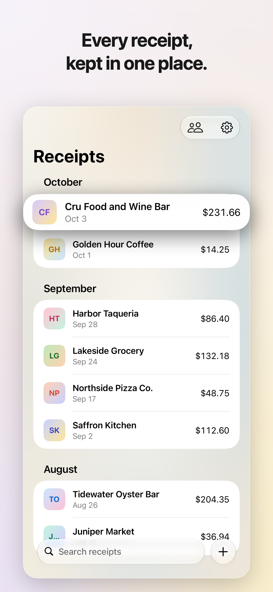
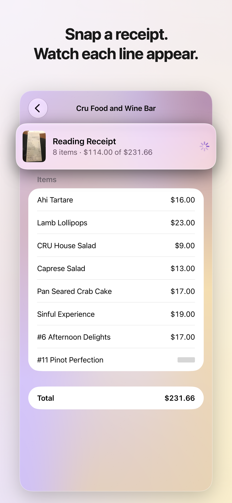
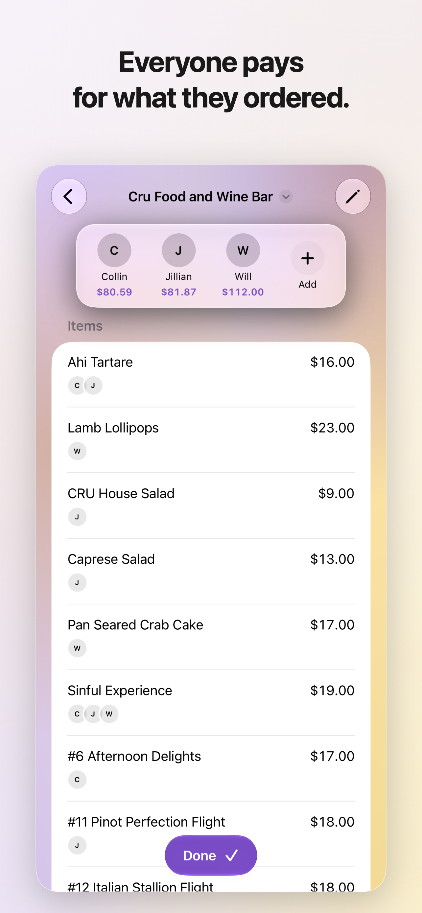
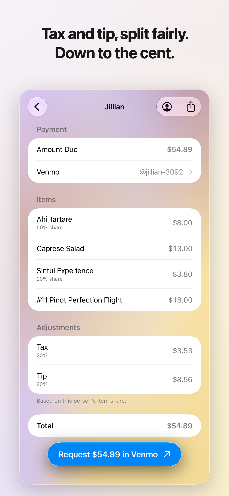
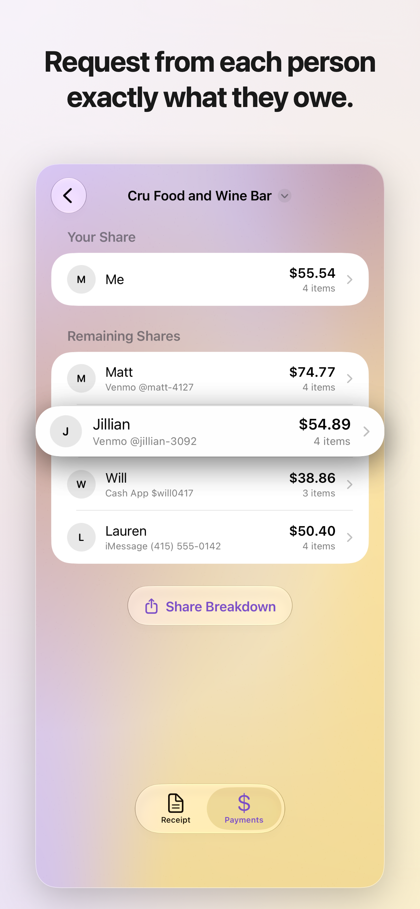
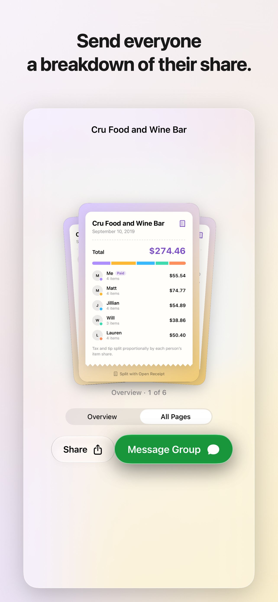

# Open Receipt

Scan. Split. Settle. Open Receipt turns a receipt into an itemized bill. Assign items to friends, split tax and tip, and send payment requests without doing the math.

<p align="center">
  
  
  
  
  
  
</p>

## Requirements

The app runs on iPhone with iOS 27 or later. Receipt reading uses
`PrivateCloudComputeLanguageModel`, so it needs Apple Intelligence: iPhone 15 Pro, iPhone 15 Pro
Max, or any iPhone 16 or later, with Apple Intelligence turned on. On other devices you can still
create and split receipts manually.

You can add people from Contacts or by name. The app asks for Contacts access the first time you
open a screen that picks from Contacts, and iOS lets you share only selected contacts.

To develop the app:

- macOS 27+
- Xcode 27+, selected with `xcode-select`
- The iOS 27 simulator runtime (`xcodebuild -downloadPlatform iOS`)
- Nix with `nix-command` and `flakes` enabled

`nix develop` checks these and tells you what's missing. It also installs Xcode's Metal Toolchain if needed.

## Run on the simulator

```
nix develop
make run
```

Run every `make` command from inside `nix develop`. The development shell provides the
command-line tools, and Xcode provides the Apple SDKs. `make help` lists all commands.

The simulator can't reach Private Cloud Compute, so it reads a sample receipt instead.

## Run on your iPhone

1. Turn on Developer Mode on the iPhone (Settings > Privacy & Security > Developer Mode), and
   connect it to your Mac.
2. Build and install with your Apple Developer team ID:

   ```
   make run-device TEAM_ID=YOUR_TEAM_ID
   ```

   The team ID is saved to `project.local.yml` (gitignored), so later builds don't need it.
   If more than one device is paired, the app installs on the first one listed.

This Debug build doesn't include the PCC entitlement, so it reads sample receipts and uses a
stand-in purchase.

To read real receipts, make a Release build. First:

1. [Request PCC access from Apple](https://developer.apple.com/contact/request/private-cloud-compute/)
   for the developer team. The team must be in the App Store Small Business Program.
2. After approval, open [Identifiers](https://developer.apple.com/account/resources/identifiers/list),
   select `com.collinmurch.open-receipt`, enable **Access to models on Private
   Cloud Compute**, and save.

Then run:

```
make run-device release=1
```

You don't need to download a profile. Automatic signing creates one with the
entitlement. See Apple's [managed capabilities guide](https://developer.apple.com/help/account/reference/provisioning-with-managed-capabilities/).

A Release build you install yourself acts like a TestFlight build. Settings shows a Testing
section where you can turn sample receipts on and change how many free reads are left. Buying
Unlimited Reading uses the App Store sandbox, so the in-app purchase
`com.collinmurch.openreceipt.unlimited` must exist in App Store Connect.

## TestFlight upload

Create the app in App Store Connect with the bundle ID
`com.collinmurch.open-receipt`. Sign in to the Apple Developer account in Xcode, then run:

```
make upload build_number=auto
```

`auto` lets Xcode pick the next build number that App Store Connect hasn't received yet.
To upload with an App Store Connect API key instead of the Xcode account, add
`ASC_KEY_ID=... ASC_ISSUER_ID=... ASC_KEY_PATH=/absolute/path/to/AuthKey.p8`. Keep the key
outside this repository.

Apple Intelligence doesn't work in China mainland, so distribute the app in every App Store
territory except China mainland. Check [Apple's availability page](https://support.apple.com/en-us/121115)
before each release.

## Parser development

`make receipts` builds a signed macOS `ReceiptLab.app` and runs the parser on receipt
fixtures through Private Cloud Compute. Signing needs the same PCC-enabled App ID as a
Release build.

```
make receipts               # evaluate receipt fixtures
make receipts cached=1      # replay cached responses without calling PCC
```

Git ignores `Fixtures/Receipts/` because receipt scans are large and can contain
private data. See [Fixtures/README.md](Fixtures/README.md) for instructions to
add and run local fixtures.
